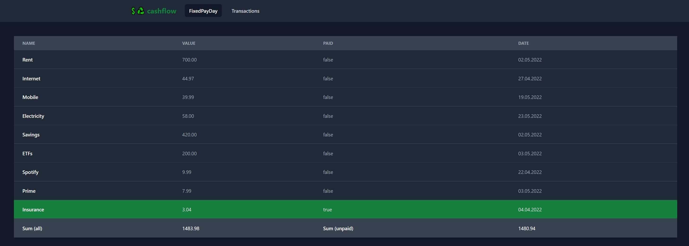

# cashflow

<p align="center">
  
</p>

Generates financial reports from various data sources.

This software is still under heavy development,
if you want to see the next plans consider reading the _Future plans_ section.

Also checkout the available reports, to see what you can already do with this software.

## Why?

I love to have an overview over my finances and I love programming.
This is why I created cashflow.
There will be plenty of reports in the future,
so you (and me) can get the best overview on what your (or my) current financial situation looks like.

## Setup

Run `npm start` to install, build and run the project.

Before you start, you need to configurate _cashflow_.
When you are done, you can test your configuration running one of the available reports.

First you need to setup a .env in `src/web` with the following content:

```jsonc
BACKEND_ADDRESS="localhost:8080"
```

Example `data/config.json`:

```jsonc
{
    // allowedLogLevel: determines which logs should be logged, "debug" allows all logs, default log level is "error"
    "allowedLogLevel": "error",
    // used in the reports, deffault is "€$"
    "currency": "€",
    // used to format dates for logs and in reports, see https://date-fns.org/v1.30.1/docs/format, default is "dd.MM.yyyy"
    "dateFormat": "dd.MM.yyyy",
    // used to format time for logs and in reports, see https://date-fns.org/v1.30.1/docs/format, default is "HH:mm:ss"
    "timeFormat": "HH:mm:ss",
    // default is false, uncategorized transaction are marked as "unmatched", when true every transaction needs to be matched or an error is printed
    "strict": false,
    // user configuration on when to start a report, otherwise "oldest" transaction is used
    "startDate": "01.01.2021",
    // user configuration on when to end a report, today is used as default
    "endDate": "31.12.2021",
    // has to be either "trend" or "fixedpayday", otherwise an error is printed
    "report": "trend",
    // only used in trend report, can be fixed, variable, special or income for a detailed categorized report on a specific transaction type,
    // default is a trend report on all transaction types, without showing the details of every category.
    "trendType": "fixed",
    // options for a data source
    "source": {
        "type": "csv", // api will be supported some day
        "path": "", // either a directory where all .csv files are loaded and merged or a path directly to one csv file
        "dataKeys": {
            // used to match the columns to generate transaction of every row in a csv file
            "initiator": "",
            "purpose": "",
            "value": "",
            "date": ""
        },
        "formats": [
            // multiple column formats are possible
            {
                "columns": [] // has to be filled apropriatly by the user
            }
        ],
        "dateFormat": "MM/dd/yyyy" // optional when date format in csv file and date format for logs and other output are different
    },
    // a list of categories to categorize every transaction from source, can be used in combination with strict: true
    "categories": [
        // has to be filled apropriatly by the user
        {
            "name": "example",
            "type": "fixed", // or fixed, special, income
            "period": "mothly", // default or yearly, quarter, half, only used in combination with fixed type
            "samples": [
                {
                    "initiator": "", // exact initiator of a transaction to match, when started with ~ the following string has to be included
                    "purpose": "" // optional, used in combination with the initiator sample, only as included search
                }
            ]
        }
    ]
}
```

An example configuration, like this, is created on first start up.

## Available reports

### Fixed pay day

Uses every as _fixed_ categorized transaction and displays there data in a table.
This report is usefull to see the height of ones fix costs,
how much is to pay in the current month
and the last booking date gives an asumption on when the next expense is expected.

#### Usage

```bash
npm run report:fixedpayday -- -c data/sample-config.json
```

#### Result

```bash
┌─────────┬──────────────────────┬───────┬─────────────┬─────────────────┬───────────┐
│ (index) │       category       │ paid  │    cost     │ lastBookingDate │  period   │
├─────────┼──────────────────────┼───────┼─────────────┼─────────────────┼───────────┤
│    0    │        'rent'        │ true  │ '-700.00 $' │  '01/03/2022'   │ 'monthly' │
│    1    │      'internet'      │ false │ '-44.97 $'  │  '12/30/2021'   │ 'monthly' │
│    2    │       'mobile'       │ false │ '-39.99 $'  │  '12/21/2021'   │ 'monthly' │
│    3    │    'electricity'     │ true  │ '-58.00 $'  │  '01/04/2022'   │ 'monthly' │
│    4    │        'car'         │ false │ '-169.47 $' │  '12/21/2021'   │ 'monthly' │
│    5    │ 'music subcription'  │ false │  '-9.99 $'  │  '12/22/2021'   │ 'monthly' │
│    6    │ 'movie subscription' │ true  │  '-7.99 $'  │  '01/03/2022'   │ 'monthly' │
│    7    │   'car insurance'    │ true  │ '-70.74 $'  │  '11/30/2021'   │ 'yearly'  │
│    8    │        'loan'        │ false │ '-19.45 $'  │  '06/07/2021'   │ 'monthly' │
│    9    │        'Sum'         │ null  │ '1120.60 $' │      null       │   null    │
│   10    │       'Unpaid'       │ null  │ '283.87 $'  │      null       │   null    │
└─────────┴──────────────────────┴───────┴─────────────┴─────────────────┴───────────┘
```

### Trend

Shows the trend of every category type, fixed, variable,
income and special in a monthly period.

#### Usage

```bash
npm run report:trend -- -c data/sample-config.json
```

#### Result

```bash
┌─────────┬────────────┬──────────────┬──────────────┬─────────────┬──────────────┬──────────────┬─────────────┐
│ (index) │  category  │   2021.08    │   2021.09    │   2021.10   │   2021.11    │   2021.12    │   2022.01   │
├─────────┼────────────┼──────────────┼──────────────┼─────────────┼──────────────┼──────────────┼─────────────┤
│    0    │  'fixed'   │ '-870.27 $'  │ '-1003.43 $' │ '-853.61 $' │ '-1868.30 $' │ '-972.41 $'  │ '-765.99 $' │
│    1    │ 'variable' │ '-1271.41 $' │ '-1281.17 $' │ '-694.19 $' │ '-1457.65 $' │ '-1601.41 $' │ '-229.79 $' │
│    2    │  'income'  │ '2915.94 $'  │ '2915.94 $'  │ '2915.94 $' │ '2915.94 $'  │ '3431.01 $'  │  '0.00 $'   │
│    3    │ 'special'  │   '0.00 $'   │ '-1638.78 $' │  '0.00 $'   │   '0.00 $'   │   '0.00 $'   │  '0.00 $'   │
└─────────┴────────────┴──────────────┴──────────────┴─────────────┴──────────────┴──────────────┴─────────────┘
```

### Trend (type)

Shows the trend for a specific category type, e.g. fixed, variable,
income or special in a monthly period.
Every category used in this type is printed in each line of the result.

#### Usage

The example only shows the fixed type, but the type can be switched to variable, income or special.

```bash
npm run report:trend:fixed -- -c data/sample-config.json
```

#### Result

```bash
┌─────────┬──────────────────────┬────────────────────────┬────────────────────────┬────────────────────────┬────────────────────────┬────────────────────────┬────────────────────────┐
│ (index) │       category       │        2021.08         │        2021.09         │        2021.10         │        2021.11         │        2021.12         │        2022.01         │
├─────────┼──────────────────────┼────────────────────────┼────────────────────────┼────────────────────────┼────────────────────────┼────────────────────────┼────────────────────────┤
│    0    │        'rent'        │ '-700.00 $ 08/02/2021' │ '-700.00 $ 09/01/2021' │ '-700.00 $ 10/01/2021' │ '-700.00 $ 11/01/2021' │ '-700.00 $ 12/01/2021' │ '-700.00 $ 01/03/2022' │
│    1    │      'internet'      │ '-44.97 $ 08/31/2021'  │ '-44.97 $ 09/30/2021'  │ '-44.97 $ 10/29/2021'  │ '-44.97 $ 11/30/2021'  │ '-44.97 $ 12/30/2021'  │        '0.00 $'        │
│    2    │       'mobile'       │ '-29.98 $ 08/20/2021'  │ '-32.00 $ 09/21/2021'  │ '-39.66 $ 10/25/2021'  │ '-39.99 $ 11/19/2021'  │ '-39.99 $ 12/21/2021'  │        '0.00 $'        │
│    3    │    'electricity'     │ '-47.00 $ 08/24/2021'  │ '-47.00 $ 09/23/2021'  │ '-47.00 $ 10/27/2021'  │ '-47.00 $ 11/23/2021'  │        '0.00 $'        │ '-58.00 $ 01/04/2022'  │
│    4    │        'car'         │  '-3.30 $ 08/05/2021'  │ '-169.47 $ 09/21/2021' │  '-4.00 $ 10/12/2021'  │ '-169.47 $ 11/22/2021' │ '-169.47 $ 12/21/2021' │        '0.00 $'        │
│    5    │ 'music subcription'  │  '-9.99 $ 08/24/2021'  │  '-9.99 $ 09/22/2021'  │  '-9.99 $ 10/22/2021'  │  '-9.99 $ 11/23/2021'  │  '-9.99 $ 12/22/2021'  │        '0.00 $'        │
│    6    │ 'movie subscription' │  '-7.99 $ 08/02/2021'  │        '0.00 $'        │  '-7.99 $ 10/01/2021'  │  '-7.99 $ 11/02/2021'  │  '-7.99 $ 12/01/2021'  │  '-7.99 $ 01/03/2022'  │
│    7    │   'car insurance'    │ '-27.04 $ 08/30/2021'  │        '0.00 $'        │        '0.00 $'        │ '-848.89 $ 11/30/2021' │        '0.00 $'        │        '0.00 $'        │
└─────────┴──────────────────────┴────────────────────────┴────────────────────────┴────────────────────────┴────────────────────────┴────────────────────────┴────────────────────────┘
```

## Tests

I used this project to train my TDD skills.
This means, I wrote the tests first and then the production code.
So nearly every line of code in this project has a corresponding unit test.

To run every test, type:

```
npm test
```

Also check out the tests to see how the software was planned to be used.

To see test coverage, run:

```
npm test:coverage
```

## Web Mode

Since 0.14.0 there is also a web mode besides the cli mode of this application.
You can start it as following:

```
# in project root
npm run build
node dist/index.js -m server -c <path-to-your-config>
# in src/web
# create a file .env with the following content
VITE_BACKEND_ADDRESS="<your-ip-address>"
# I also need to run wsl-portforward.ps1,
# but only because I run this application in wsl and want to expose it to my network
# Now run the following in src/web
# rebuilds the styles
npm run styles:watch
# start frontend
npm run dev
```

As you can see, there is no "ready to go" build that you can start.
I'll plan to add it as soon that i deploy the app in my home network.

The reports (currently only FixedPayDay is available in web mode) will now be available in web:



## Future plans

This software is still under heavy development and these are the next steps:

-   Implementing ApiConnector, to get the freshest Data from a web server
    -   I reached out to my bank and waiting now, that my bank finishes its API for private use.
-   Implementing a budget report
